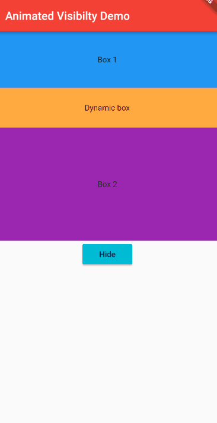
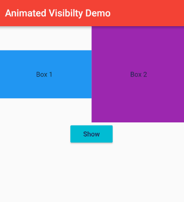

## animated_visibility

[](https://github.com/Solido/awesome-flutter)


A package to easily animate visibility of an element in multichild widgets like rows, columns, listviews and more.




## Getting started


### With Flutter:
```
flutter pub add animated_visibility
```

### This will add a line like this to your package's pubspec.yaml (and run an implicit flutter pub get):
```
dependencies:
  animated_visibility: ^1.0.0
```


## Usage

```dart
     AnimatedVisibility(
            isVisible: _isVisible, //whether widget should be visible or hidden
            duration: const Duration(milliseconds: 400), //duration of transition animation
            curve: Curves.easeIn, //cure of animation. default is easeIn
            child: Container(
              height: 70,
              width: double.infinity,
              color: Colors.orangeAccent,
              alignment: Alignment.center,
              child: const Text('Dynamic box'),
            ),
          ),
```
